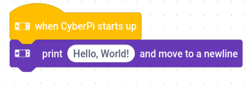

# Documentation

The following instructions assume that you have successfully [installed](https://github.com/juho05/embe#installation) *embe* on your system.

The recommended editors for *embe* are [VS Code](https://code.visualstudio.com/) and [Neovim](https://neovim.io/) with the [vscode-embe](https://github.com/juho05/vscode-embe) and the [vim-embe](https://github.com/juho05/vim-embe) plugin, respectively.

Click [here](stdlib.md) for a list of available events, functions and variables.

## Table of Contents

- [Hello World](#hello-world)
- [Events](#events)
- [Functions](#functions)
- [Expressions](#expressions)
  - [Data Types](#data-types)
    - [String](#string)
    - [Boolean](#string)
    - [Conversion between Types](#conversion-between-types)
  - [Functions as Expressions](#functions-as-expressions)
- [Variables](#variables)
- [Control Flow](#control-flow)
  - [if-else](#if-else)
  - [loops](#loops)
- [Custom Variables](#custom-variables)
  - [Constants](#constants)
  - [Lists](#lists)
- [Custom Functions and Custom Events](#custom-functions-and-custom-events)
- [Preprocessor](#preprocessor)

## Hello World

To get started write the following text into a file named `hello.mb`:

```csharp
@launch:
  display.println("Hello, World!")
```

To execute the code on your robot open a terminal in the current directory and enter `embe hello.mb`.
This will compile the `hello.mb` file into a `hello.mblock` file. You can now open the file in the [mBlock IDE](https://ide.mblock.cc/) as you would do with any other mBlock project file.
After the loading is complete you should see these blocks automatically generated for you:



When executed, these blocks should make the text `Hello, World!` appear on the screen of your robot.

## Events

Every scratch program begins with events like *when CyberPi starts up* in the previous picture. They execute the code below them
when a certain condition is met.

In embe these events are represented with the `@<event_name>` syntax.

To run code when the robot is started use the `@launch` event:
```csharp
@launch:
  // ...
```

Events can also take arguments. One such example is the `@button` event which is triggered when a button is pressed:
```csharp
@button "a":
  // code to run when the A button is pressed

@button "b":
  // code to run when the B button is pressed
```

Every following line that is indented at least as much as the `@...` line belongs to the next event above it.
This concept is used throughout *embe* for every code construct that ends with the `:` character. These include if-statements, loops, function declarations and many more.

## Functions

To make your program do something there are many different functions provided for you by *embe* which translate to all the different blocks available in *mBlock*.

Function calls always take the form: `<namespace>.<name>(<parameters...>)`

The simplest function to call is `audio.stop` which stop all audio:
```csharp
// functions can only be called inside of event blocks
@launch:
  audio.stop() // audio.stop takes no parameters
```

Function arguments are separated by `,` characters:
```csharp
@launch:
  audio.playNote("c", 5, 10) // note name, octave, duration
```

Some function can take different arguments and change their behavious depending on which ones are used:
```csharp
@launch:
  time.wait(5) // waits 5 seconds
  time.wait(mbot.battery < 20) // waits until the battery is under 20 %
```

## Expressions

Functions don't only take literal values like `5` or `"Hello"` as arguments. Most of the can take any expression.

The simplest form of expressions can be constructed with math operators.
You can add, subtract, multiply and divide numbers:
```csharp
@launch:
  time.wait(5+3) // wait 8 seconds
  time.wait(5-3) // wait 2 seconds
  time.wait(5*2) // wait 10 seconds
  time.wait(5/2) // wait 2.5 seconds
  time.wait(5%2) // wait 1 second (remainder of 5/2)
```

You can also compare these values with one another:
```csharp
@launch:
  time.wait(20 > 10) // wait until 20 is greater than 10
  time.wait(20 < 10*3) // wait until 20 is less than 30
  time.wait(5 == 5) // wait until 5 is equal to 5
  time.wait(5 >= 5) // wait until 5 is greater or equal to 5
  time.wait(4 <= 5) // wait until 4 is less than or equal to 5
  time.wait(5 != 4) // wait until 5 is not equal to 4
```

These conditions can be combined by using the `&&` (and) and `||` (or) operators.
```csharp
@launch:
  time.wait(20 > 10 || 30 < 20) // wait until 20 is greater than 10 OR 30 is less than 20. OR conditions are true when at least on of the operands evaluates to true.
  time.wait(20 > 10 && 30 < 40) // wait until 20 is greater than 10 AND 30 is less than 40. AND conditions are true when both operands evaluate to true.
```

### Data Types

Up until now all expressions only contained numbers. But you can also operate on *string* (text) values and *booleans* (conditions).

#### String

Strings are enclosed by `"` characters to differentiate them from other data types:
```csharp
@launch:
  time.wait(5) // 5 is a number
  display.println("5") // 5 is a string
```

Some operators like `==` or `+` also work for strings while others like `/` do not:
```csharp
@launch:
  time.wait("Hello", "Hello") // wait until Hello is equal to Hello
  display.println("Hello" + " " + "World") // -> Hello World
```

#### Boolean

Booleans represent a condition like `5 == 5`. They can be either *true* or *false*. Due to restrictions of mBlock. These values are more restricted than strings and numbers.
They cannot for example be stored in a variable.

#### Conversion between Types

You can convert between numbers and strings with the `number()` and `string()` functions:
```csharp
@launch:
  time.wait(number("5")) // wait 5 seconds
  display.println(string(5)) // print 5 to the screen
```

### Functions as Expressions

Some functions return a value. They must be used as a expression and cannot stand on their own.
They provide more complex behaviour than simple operators:

```csharp
@launch:
  time.wait(math.sqrt(9) + 1) // 3 + 1 = 4
  time.wait(math.round(9.6)) // 10
  time.wait(strings.length("hello")) // 5
  time.wait(strings.contains("hello", "hell")) // true
```

They can also be used to query the various sensors of the robot:
```csharp
@launch:
  time.wait(sensors.acceleration("x")) // current acceleration on the x axis
  time.wait(sensors.isTilted("left") || sensors.isTilted("right")) // whether the robot is either tilted to the left or to the right
```

## Variables

Some blocks aren't represented as functions but rather as variables.
One such example is the `audio.volume` variable.

```csharp
@launch:
  audio.volume = 5 // set the volume to 5 %
  audio.volume += 5 // increase the volume by 5 %
  audio.volume -= 5 // decrease the volume by 5 %
  audio.volume *= 2 // double the volume
  audio.volume /= 2 // divide the volume by 2
  display.println(string(audio.volume)) // print the current volume to the screen
```

Some variable like `sensors.distance` cannot be assigned to:
```csharp
@launch:
  display.println(string(sensors.distance)) // print the value measured by the distance sensor to the screen
  sensors.distance = 5 // error
```

## Control Flow

Most applications need to make decisions based on their current state and decide to execute or repeate some code.
Control flow construct allow you let your code make these decisions.

### if-else

To execute a piece of code only when a certain condition is true use an if-statement:
```csharp
@launch:
  if mbot.battery < 20:
    display.println("battery low") // executed when the battery charge is below 20 %
  else:
    display.println("battery is fine") // executed when the battery charge is greater or equal to 20 %
```

You can chain multiple if-statements together with the `elif` keyword:
```csharp
@launch:
  if mbot.battery < 10:
    display.println("battery very low") // executed when the battery charge is below 10 %
  elif < 20:
    display.println("battery low") // executed when the battery charge is below 20 % but above or equal to 10 %
  elif < 50:
    display.println("battery below 50 %") // executed when the battery charge is below 50 % but above or equal to 20 %
  else:
    display.println("bettery is fine") // executed when the battery charge is above or equal to 50 %
```

### loops

To repeat a piece of code indefinitely, use the while-loop:

```csharp
@launch:
  while:
    display.println("hello") // will print hello repeatedly until the script is stopped
```

To repeat a piece of code as long as a condition is met, use the while-loop with a condition:
```csharp
@launch:
  while sensors.distance >= 10:
	motors.moveDistance(10) // move 10 cm at a time until an object in front of the robot is less than 10 cm away
```

To repeat a piece of code a number of times, use the for-loop:
```csharp
@launch:
  for 10:
    display.println("hello") // will print hello 10 times
```

## Custom Variables

You can define your own variables with the `var` keyword. Variables in *embe* are global and must therefore be declared outside of any event body:
```csharp
var message = "Hello, World!" // creates a new string variable with the content: Hello, World
var message2: string // creates a new string variable with empty content
var num = 5 // creates a new number variable and initializes it with 5
var num: number // creates a new number variable and initializes it with 0

@launch:
  display.println(message) // -> Hello, World!
  message = "Bye, World!"
  display.println(message) // -> Bye, World!

  num += 3 // -> num = 8
```

Variables can contain strings, numbers and images.

### Constants

Oftentimes you never want to modify a variable but just assign a name to a value so you don't need to change the value in multiple places in case you want to change it.
Constants are useful exactly for this purpose. An additional upside to using them is that they can be used in places where variables are not allowed, e.g. as event parameters:

```csharp
const btn = "b"

@button btn: // executed when the B button is pressed
  display.println(btn) // -> b
  b = "a" // error
```

### Lists

Lists can hold a variable amount of values of the same type. You can define a list similarly to defining a variable:
```csharp
var mylist = [1, 2, 3, 4]
var mylist2 = ["hello", "world"]

// you need to explicitly provide the type to create an empty list
var mylist3: number[]
var mylist4: string[]
```

Lists can be manipulated with the `lists.*` functions:
```csharp
var mylist = ["hello", "world"]

@launch:
  display.println(lists.get(mylist, 1)) // -> world (indices start at 0)
  lists.append(mylist, "!") // -> ["hello", "world", "!"]
  lists.remove(mylist.remove(mylist, 1)) // -> ["hello", "!"]
  time.wait(lists.length(mylist)) // -> 2
  lists.insert(mylist, 1, "earth") // -> ["hello", "earth", "!"]
  lists.replace(mylist, 1, "globe") // -> ["hello", "globe", "!"]
  time.wait(lists.indexOf(mylist, "!")) // -> 2
  time.wait(lists.contains(mylist, "hello")) // -> true
  lists.clear() // remove all elements from the list
```

## Custom Functions and Custom Events

You can create your own functions to better organize your codebase:

```go
func myfunc():
  time.wait(1)

func myfunc2(duration: number):
  time.wait(duration)

func myfunc3(duration: number, name: string):
  time.wait(duration)
  display.println("Hello " + name + "!")

@launch:
  myfunc() // waits 1 second
  myfunc2(5) // waits 5 seconds
  myfunc3(5, "Bob") // waits 5 seconds and prints: Hello Bob!
```

Custom events allow you to start multiple codepaths simultaneously:
```csharp
event myevent

@myevent:
  time.wait(1)
  display.print("Hello ")

@myevent:
  time.wait(2)
  display.println("World!")

@launch:
  myevent() // waits 1 second, prints Hello , waits another second and prints World!
```

## Preprocessor

The preprocessor is a program that transforms your code before giving it to the compiler.
It allowes to exlude code from compiling or to replace text with other text.

Embe supports the C-style preprocessor statements `#define`, `#ifdef`, `#ifndef`, `#endif` and `#undef`.

You can create a preprocessor constant with an optional value with the `#define` keyword.
```cpp
#define EVENT button "a" // every occurence of EVENT after this statement will be replaced with: button "a"

@EVENT: // this line becomes: @button "a":
  time.wait(1)

#undef EVENT // this undefines EVENT

@EVENT: // error: unknown event
  time.wait(1)
```

You can check whether a preprocessor constant is defined with `#ifdef`:
```cpp
#define DEBUG

@launch:
#ifdef DEBUG // only include the following code until #endif if DEBUG is defined
  display.println("@launch called")
#endif
```

To check whether a preprocessor constant is *not* defined use `#ifndef`.
